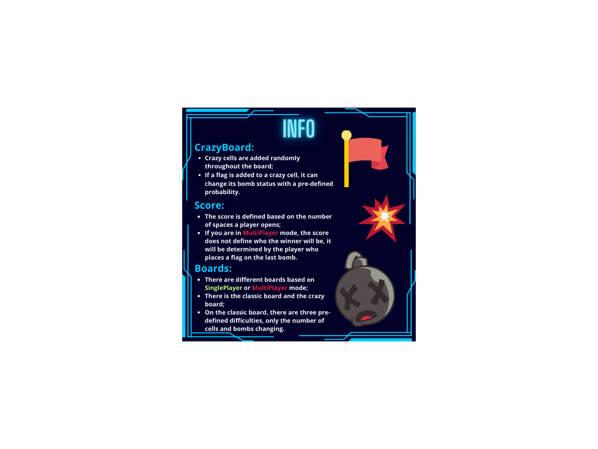

# MineSweeper

Welcome to MineSweeper, a Java implementation of the classic puzzle video game. This project was developed as part of an Object-Oriented Programming course and includes some new features such as multiplayer mode and crazy mode.

## Features

- **Customizable Difficulty**: Choose between different board sizes and mine densities to tailor the game to your skill level.
- **Intuitive GUI**: Enjoy a user-friendly graphical user interface designed for smooth gameplay.
- **Flagging System**: Mark potential mine locations with flags to help you avoid accidental detonations.
- **Multiplayer Mode**: Challenge your friends in real-time multiplayer mode and see who can win!
- **Crazy Mode**: Experience an extra challenging version of MineSweeper.

### Installation

1. Clone the repository to your local machine:

    ```bash
    git clone https://github.com/yourusername/MineSweeper.git
    ```

## How to Play

- Left-click on a cell to reveal its content.
- Right-click (or use the context menu) to flag a potential mine location.

## Preview



